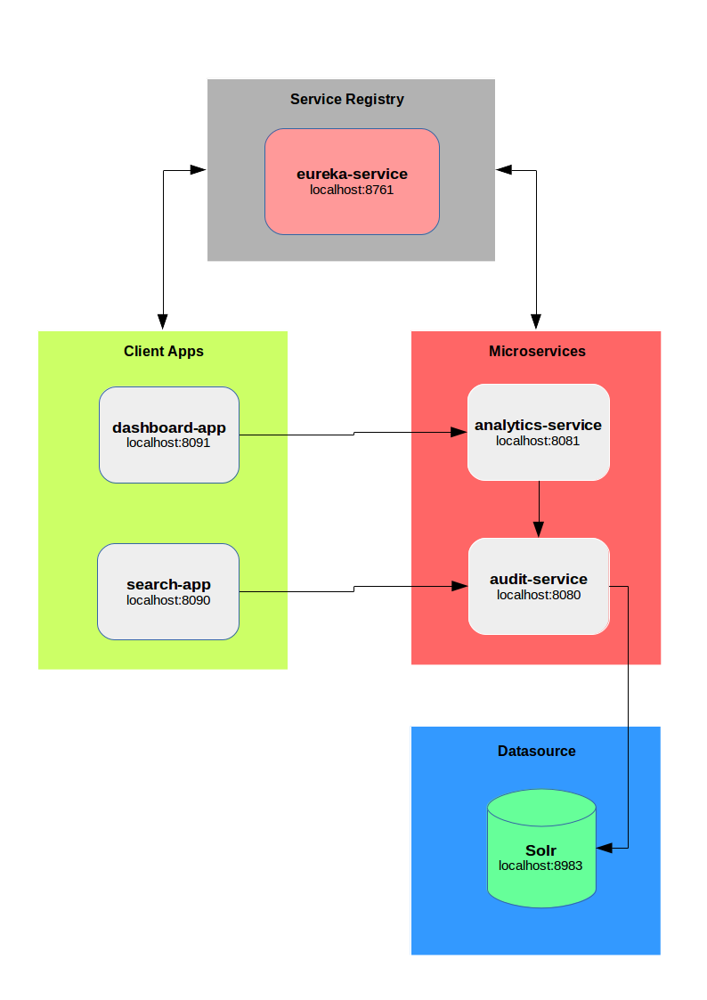

```{r setup, include=FALSE}
knitr::opts_chunk$set(echo = TRUE)
```

## Introduction

Through this article, I am going to explian how to leverage microservices architecture to build realtime dashboard which shows the hot searched topics hits.

To clone the source code, visit <https://github.com/ashrafsarhan/spring-cloud-microservices>.

##1. Project Environment
* Spring Tool Suite 3.8.2.RELEASE
* JDK 1.8
* Apache Maven 3.3.9
* Spring Cloud Eureka
* Spring MVC
* Spring Data Solr
* Apache Solr 6.3
* WebSocket (STOMP)
* Webjars (Bootstrap + JQuery)

##2. Project Structure
* search-app
    + Simulate search functionality to catch the user input and sent it to the audit service.
* dashboard-app
    + Dashboard application provides realtime analytics insights for end users based via audit service using Solr facet query, it depends mainly on the messaging architecture using STOMP (Websockt Sub Protcol), Websockt provides full-duplex, two-way communication between client and server^[1]^.
* audit-service
    + Audit service logs the user search behavior into Solr index using Spring solr data.
* analytics-service
    + Analytics service provides realtime insights about the hot searched topics based on audit service.
* eureka-service
    + Eureka service provides services discovery functionality.

##4. Project Architecture



The following explains the message flow for the architecture:

* Our eureka-service provides the service registry functionlity to let the serivces knows each other. 

* Each service and app client register itself with the running eureka server.

* On every service-to-service or app-to-service call, the caller must request the eureka-service to trade the requested app/service name with a running instance for this app/service. 

##5. Project Testing/Running
There are some Junit cases to test the functionalities, which are running during the project build phase. After building all the projects, go to the target dir and you will find an excutable deployable fat jars (app-name.jar) which contains all the dependencies with an embbeded tomcat application server.

To build the project, run the following mvn command:

```
mnv clean install
```

##6. Future Enhancement
Actully, I did my best to build this beta version but still there are many enhancements (TODOs) to improve The current beta version and the followings are examples:

* I am using DiscoveryClient to get the instances for the requested app, then I pick the first instance to go with. However, I have to use the load balanced way using (Ribbon) 
* Wrapping all the components in containers using Docer (Docerization).

Also, you can get a pull request or submit issues through project Git repository <https://github.com/ashrafsarhan/spring-cloud-microservices>.

##7. References
[1] Spring Framework Reference
<http://docs.spring.io/spring/docs/current/spring-framework-reference.html>

